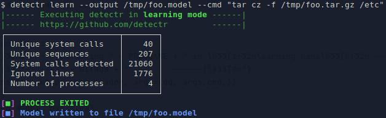
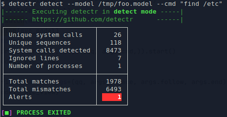

# detectr
Intrusion Detection Based on System Calls.

# Install

The easiest way to install detectr is via pip.

    pip3 install detectr

You can also install detectr from source in a virtual environment:

    git clone git@github.com:detectr/detectr.git
    cd detectr
    virtualenv -p python3 venv
    source venv/bin/activate
    pip3 install .

# Basic Usage

First, you have to build a model of the application for which
you want to detect intrusions. Typically, this is a 
web application. For this, run detectr in "learn" mode
until the number of "unique sequences" does not increase
anymore. If you have created the model you can run detectr
in "detect" mode to find intrusions. 

Build a model for tar:

    detectr learn --output foo.model --cmd "tar cz -f foo.tar.gz /etc"
    
Use the model to detect intrusions:

    detectr detect --model foo.model --cmd "tar cz -f foo.tar.gz /etc"

As you're running the same command, detectr should not
find any intrusions. If you execute any other command,
detectr should produce alarms:   

    detectr detect --model foo.model --cmd "find /etc"
    
Screenshot of the learning mode:

Screenshot of detection mode:

